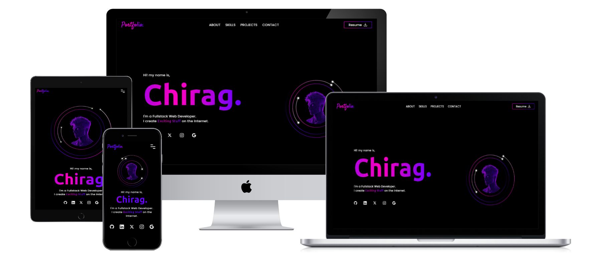
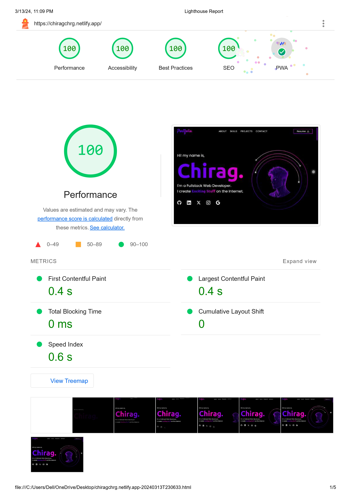

[](https://sivakumar-beta.vercel.app/)

[](https://opensource.org/licenses/MIT)

##### Created : 09/04/2023

# Sivakumar | My Personal Portfolio | Fullstack Web Developer
Welcome to Sivakumar's portfolio website, your gateway to the dynamic world of full stack web development. Immerse yourself in the digital realm where my expertise in coding and design converges to create extraordinary online experiences.

## 💻 Preview


## 🚀 Live Demo  
Explore the live demo of the portfolio: [https://sivakumar-beta.vercel.app](https://sivakumar-beta.vercel.app).  

### 🚧 Nightly Build in Progress  
A new version of this portfolio is currently under active development. It’s not just a facelift—this build includes powerful new features meant for reuse and personalization:

- **Templatized Portfolio** – Easily fork and customize your own portfolio with minimal effort.
- **Custom Theme System** – Pick from multiple themes that adapt to your preferences, each with light and dark mode variants.
- **Quality Enhancements** – Includes performance tweaks, UI touch-ups, and subtle improvements all around.

Curious? Dive into the latest build here:  
🔗 **https://sivakumar-beta.vercel.app**

<br/>

## 📚 Tools and Tech Stack

The portfolio leverages the following technologies:
<div align="center">
      <a href="https://astro.build/" title="Astro"></a>&emsp;
      <a href="https://preactjs.com/" title="Preact.js"></a>&emsp;
      <a href="https://www.typescriptlang.org/docs/" title="TypeScript"></a>&emsp;
      <a href="https://tailwindcss.com/docs/installation" title="TailwindCSS"></a>&emsp;
      <a href="https://greensock.com/docs/" title="GSAP"></a>&emsp;
</div>

## 🗼 LightHouse Audit


## 🛠️ Installation and Setup

Follow these steps to run the project locally:

### Steps
1. Clone the repository:
   ```bash
   git clone https://github.com/Sivakumar1016/Sivakumar.git
   ```
2. Navigate to the project directory:
   ```bash
   cd portfolio
   ```
3. Install dependencies:
   ```bash
   npm install
   ```
4. Start the development server:
   ```bash
   npm run dev
   ```

## 🌟 Features

- **Optimized Performance**: Built with Astro for lightning-fast load times.
- **Responsive Design**: Tailored for all devices using TailwindCSS.
- **Interactive Animations**: Powered by GSAP for smooth transitions.
- **SEO Friendly**: Enhanced visibility with Astro SEO integration.
- **Dynamic Components**: Utilizes Preact for modular and reusable UI elements.

## 📄 License

This project is licensed under the [MIT License](LICENSE).  
You may use, copy, modify, and distribute this project for any purpose, provided that you:

- Include the original copyright.
- Retain the MIT license in all copies or substantial portions of the software.
- Visible credit is given to **[Sivakumar](https://github.com/Sivakumar1016)** somewhere within your project (e.g., in the README, footer, or documentation).

Proper attribution helps acknowledge the effort invested in this project and upholds the values of integrity, transparency, and the open‑source community.